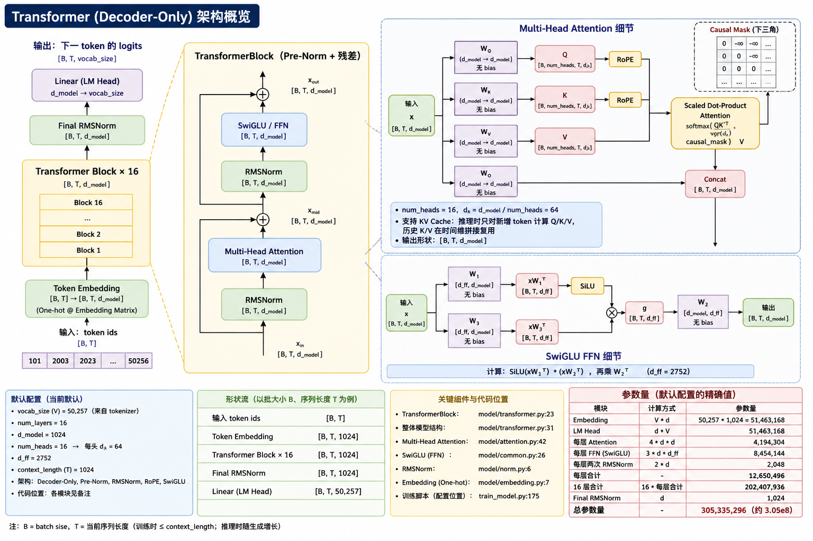

<div align="center">

# 🧠 TinyLM

### 从 Stanford CS336 Assignment 1 走向可复现实战的 Transformer 预训练项目

[](./LICENSE)
[](./pyproject.toml)
[](https://pytorch.org/)
[](#默认模型配置305m-transformer)
[](https://github.com/astral-sh/uv)

`Transformer from scratch` · `Distributed Training` · `KV Cache Inference` · `BPE Tokenizer`

[项目亮点](#项目亮点) · [模型配置](#默认模型配置305m-transformer) · [运行方法](#运行方法4-个脚本) · [许可证](#项目来源与开源说明)

</div>

## 项目来源与开源说明

本项目代码来源于 **Stanford CS336 Assignment 1**，并在遵循原开源协议的前提下进行了结构调整与功能修改后开源。

- 原始来源：Stanford CS336 Assignment 1
- 当前仓库：面向实际训练/评估流程做了工程化整理
- 许可协议：详见 [LICENSE](./LICENSE)

## 项目亮点

- 从零开始实现 Transformer 语言模型核心模块（注意力、RoPE、RMSNorm、SwiGLU 等）
- 多进程并行数据预处理与分词，支持大文本切分后高效转 `.npy` 分片
- 基于 `torchrun` 的分布式并行训练流程（单机/多卡可扩展）
- 推理阶段 KV Cache 增量解码，显著减少重复计算
- 自定义 BPE 分词器训练与加载流程，便于端到端复现实验
- 训练工程细节完善：梯度裁剪、余弦学习率调度、checkpoint 保存/恢复
- 支持单机快速冒烟与全量训练两种模式，便于开发调试和规模化运行切换

## 项目目标

TinyLM 的目标是让你可以实际体验一遍大模型预训练的核心流程，包括：

- 语料分片与分词（tokenize）
- Transformer 语言模型训练
- 分布式训练启动与调试
- 文本生成与验证集 loss 评估

## 默认模型配置（305M Transformer）

代码中的默认配置位于 `tiny_lm/train_model.py::_get_model_config`，对应一个约 **305M 参数量** 的 Transformer 语言模型。

| 配置项 | 默认值 |
|---|---:|
| `num_layers` | 16 |
| `d_model` | 1024 |
| `num_heads` | 16 |
| `d_ff` | 2752 |
| `context_length` | 1024 |
| `theta` | 10000 |
| `batch_size`（默认训练配置） | 16 |
| 参数量（估算） | ~305M |

### 模型结构示意图



## 目录结构

```text
TinyLM/
├── tiny_lm/
│   ├── tokenize_data.py
│   ├── train_model.py
│   ├── train_model_dist.py
│   └── eval_model.py
├── saved_gpt_tokenizer/
├── checkpoint/
│   └── 4.5B.cpt
└── data/
    ├── test.txt
    ├── owt_train.txt / owt_valid.txt
    ├── train_*.npy
    └── valid_*.npy
```

## 环境准备

推荐使用 `uv`：

```bash
uv sync
```

## 运行方法（4 个脚本）

### 1) `tokenize_data.py`：把文本分词并保存为 `.npy` 分片

对验证集文本做分词：

```bash
uv run python -m tiny_lm.tokenize_data \
  --data_file data/owt_valid.txt \
  --result_prefix data/valid \
  --workers 10 \
  --batch_size 100000000
```

对训练集文本做分词：

```bash
uv run python -m tiny_lm.tokenize_data \
  --data_file data/owt_train.txt \
  --result_prefix data/train \
  --workers 10 \
  --batch_size 100000000
```

### 2) `train_model.py`：单进程训练

```bash
uv run python -m tiny_lm.train_model \
  --tokenizer_dir saved_gpt_tokenizer \
  --checkpoint checkpoint/4.5B.cpt \
  --data_dir data \
  --checkpoint_base_dir checkpoint \
  --epochs 1 \
  --gradient_accumulate 8
```

快速冒烟测试可加小模型参数：

```bash
--context_length 8 --num_layers 2 --d_model 32 --num_heads 4 --d_ff 64 --batch_size 1
```

### 3) `eval_model.py`：生成文本或评估验证集 loss

自回归生成：

```bash
uv run python -m tiny_lm.eval_model \
  --mode generate \
  --tokenizer_dir saved_gpt_tokenizer \
  --checkpoint checkpoint/4.5B.cpt \
  --prompt "The capital of the United States is a place called" \
  --max_seq_len 256
```

验证集 loss：

```bash
uv run python -m tiny_lm.eval_model \
  --mode valid_loss \
  --tokenizer_dir saved_gpt_tokenizer \
  --checkpoint checkpoint/4.5B.cpt
```

### 4) `train_model_dist.py`：分布式训练（`torchrun`）

单节点示例（你要求的 `nnodes=1`）：

```bash
uv run torchrun --nnodes=1 --nproc_per_node=1 \
  -m tiny_lm.train_model_dist \
  --tokenizer_dir saved_gpt_tokenizer \
  --checkpoint checkpoint/4.5B.cpt \
  --data_dir data \
  --checkpoint_base_dir checkpoint \
  --epochs 1 \
  --gradient_accumulate 8 \
  --batch_size 16
```

## 说明

- 传入 `--checkpoint ''` 时，脚本会从随机初始化权重开始。
- `data_dir` 需要包含 `train_*.npy` 与 `valid_*.npy`。
- 当前 `.gitignore` 已忽略 `checkpoint/`、`data/` 以及常见缓存/临时文件。
