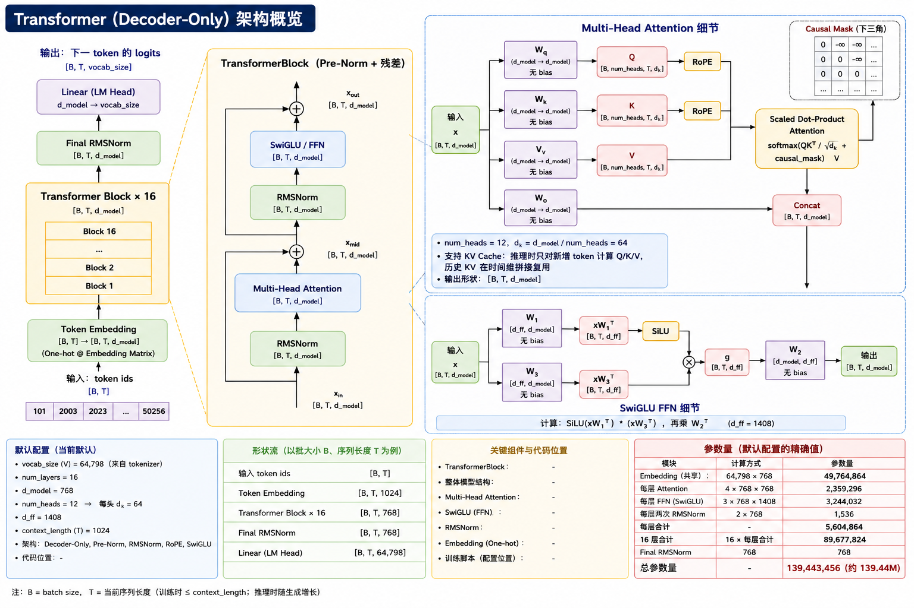

<div align="center">

# 🧠 TinyLM

### 从零实现的 Transformer 中文预训练语言模型

[](./LICENSE)
[](./pyproject.toml)
[](https://pytorch.org/)
[](./CONFIG.md#model--模型架构配置)
[](https://github.com/astral-sh/uv)

`Transformer from scratch` · `Pre-training` · `SFT / LoRA` · `KV Cache Inference`

</div>

---

## 项目来源与开源说明

本项目代码来源于 **Stanford CS336 Assignment 1**，并在遵循原开源协议的前提下进行了结构调整与功能扩展后开源。

- 原始来源：Stanford CS336 Assignment 1
- 当前仓库：面向实际训练/评估流程做了工程化整理
- 许可协议：详见 [LICENSE](./LICENSE)

---

## 项目简介

TinyLM 是一个从零实现的 Transformer 语言模型项目，基于 **PyTorch**，在 **中文百科类数据**（百度百科 + 中文维基百科）上预训练了约 **139M 参数** 的模型，并进行了指令微调。

| 版本 | 参数量 | 数据 | 状态 |
|------|--------|------|------|
| **当前分支** | **139M**（d_model=768, layers=16） | 百度百科 + 中文维基 | ✅ 可用 |
| legacy\_305M 分支 | 305M（d_model=1024, layers=16） | OpenAI WebText（英文） | 📦 已归档 |

> 旧版 305M 英文模型的代码已归档至 `legacy_305M` 分支。

### 项目亮点

- 从零实现 Transformer 核心模块（多头注意力、RoPE、RMSNorm、SwiGLU）
- 完整的预训练 + SFT + LoRA 微调流程
- 可选 Hugging Face Transformers Trainer 训练入口
- 推理阶段 KV Cache 增量解码
- 统一的 JSON 配置文件管理所有训练参数
- 基于 `uv` 的简洁运行方式

## 更新策略与仓库定位

后续功能迭代与代码更新将以 GitHub 仓库为主；ModelScope 仓库主要用于存放模型权重与训练数据。

- GitHub（代码主仓库）：https://github.com/QZero233/TinyLM
- ModelScope（权重与数据）：https://www.modelscope.cn/models/QZero233/tiny_lm

## 项目目标

TinyLM 的目标是让你可以实际体验一遍大模型训练与推理的核心流程，包括：

- 语料分片与分词（tokenize）
- Transformer 语言模型预训练
- SFT / LoRA 微调与恢复训练
- 文本生成与验证集 loss 评估

## 默认模型配置（139M Transformer）

当前默认配置文件位于 `configs/train_zh.json`，对应一个约 **139M 参数量** 的 Transformer 语言模型。

| 配置项 | 默认值 |
|---|---:|
| `num_layers` | 16 |
| `d_model` | 768 |
| `num_heads` | 12 |
| `d_ff` | 1408 |
| `context_length` | 1024 |
| `theta` | 10000 |
| `batch_size` | 12 |
| 参数量（精确） | 139,443,456 |

### 模型结构示意图



---

## 快速启动

### 1. 下载与准备数据

#### 预训练数据

从 ModelScope 下载 tokenized `.bin` 文件：

https://www.modelscope.cn/datasets/wdndev/tiny_llm_dataset

下载后放入 `data/zh_data/` 目录：

```
data/
├── zh_data/
│   ├── baidubaike_563w_1.bin
│   ├── baidubaike_563w_2.bin
│   ├── baidubaike_563w_3.bin
│   ├── baidubaike_563w_4.bin
│   ├── baidubaike_563w_5.bin
│   └── wikipedia-cn.bin
├── sft_data/
│   ├── sft_data.jsonl
│   └── sft_data_test.jsonl
└── chatglm3_tokenizer/
    ├── tokenizer.model
    ├── tokenizer_config.json
    ├── vocab.txt
    └── ...
```

#### SFT 数据

在同一数据集页面下载 JSONL 文件，放入 `data/sft_data/` 目录。每行格式：

```json
{"question": "...", "answer": "..."}
```

#### 分词器

ChatGLM3 BPE 分词器已包含在 `data/chatglm3_tokenizer/` 中。

#### 下载模型权重

从 ModelScope 模型页下载权重文件：

https://www.modelscope.cn/models/QZero233/tiny_lm

将权重放入 `checkpoint/` 目录。当前提供 3 个权重文件：

| 文件名 | 类型 | 说明 |
|------|------|------|
| `130M_72300.cpt` | Base 预训练权重 | 139M 模型在中文语料上的预训练 checkpoint |
| `130M_SFT_24800.cpt` | 全量 SFT 权重 | 可直接用于推理，也可作为后续微调的 base 权重 |
| `130M_LORA_15200_BASE_72300.cpt` | LoRA 微调权重 | 基于 `130M_72300.cpt` 进行 LoRA 微调得到 |

#### 环境

```bash
uv sync
```

### 2. 预训练

预训练参数已在 `configs/train_zh.json` 中配置好，一条命令启动：

```bash
uv run tiny_lm/train_model.py
```

从 checkpoint 恢复训练：修改 JSON 中的 `checkpoint` 字段指向已有的 `.cpt` 文件：

```json
{
  "training": {
    "checkpoint": "/path/to/checkpoint.cpt"
  }
}
```

#### 使用 Hugging Face Transformers 训练

如果希望使用 Hugging Face `Trainer` 进行训练，可以使用 `tiny_lm/hf/train_hf.py`。它复用同一份 JSON 配置和预训练 `.bin` 数据，但 checkpoint 会保存为 Hugging Face 格式，默认目录为：

```
{checkpoint_base_dir}/{project_name}_hf/
```

启动训练：

```bash
uv run python -m tiny_lm.hf.train_hf --config configs/train_zh.json
```

常用参数：

```bash
uv run python -m tiny_lm.hf.train_hf \
  --config configs/train_zh.json \
  --output-dir checkpoint_train/zh_pretrain_139M_hf \
  --max-steps 1000
```

从 Hugging Face checkpoint 恢复训练：

```bash
uv run python -m tiny_lm.hf.train_hf \
  --config configs/train_zh.json \
  --resume-from-checkpoint checkpoint_train/zh_pretrain_139M_hf/checkpoint-1000
```

说明：

- `train_hf.py` 不读取项目手写模型的 `.cpt` checkpoint。
- `training.checkpoint` 只有在指向 Hugging Face checkpoint 目录时才会用于恢复训练。
- Hugging Face 训练脚本会使用项目数据集已经右移好的 `labels`，loss 行为与手写训练脚本保持一致。

### 3. 指令微调

微调同样通过 JSON 配置。需要先设置预训练 base checkpoint 路径：

```json
{
  "training": {
    "lora": {
      "base_model_checkpoint": "/path/to/pretrained_checkpoint.cpt",
      "full_finetune": true
    }
  }
}
```

然后一条命令启动：

```bash
uv run tiny_lm/lora/lora_fine_tuning.py
```

通过 `full_finetune` 切换全量微调和 LoRA：

| `full_finetune` | 模式 |
|:---:|------|
| `true` | 全量微调（SFT，推荐） |
| `false` | LoRA 微调 |

从 checkpoint 恢复：设置 `lora.lora_checkpoint` 指向已有 checkpoint 即可。

> 配置文件说明详见 [CONFIG.md](./CONFIG.md#traininglora--lora-sft-子配置)。

### 4. 推理

#### WebUI（浏览器界面）

```bash
uv run webui/app.py --config configs/train_zh.json --port 6008
```

#### 命令行生成

```bash
uv run tiny_lm/eval_model.py --config configs/train_zh.json --prompt "中国的首都是" --max_seq_len 256
```

#### 验证集 loss

```bash
uv run tiny_lm/eval_model.py --config configs/train_zh.json --mode valid_loss
```

---

## 配置文件

所有训练参数通过 JSON 配置文件管理。详见 [CONFIG.md](./CONFIG.md)。
## 分布式训练

⚠️ **当前处于 TODO 状态，暂不可用。**

分布式训练代码位于 `tiny_lm/dist_train/`，尚未适配当前版本。

## 项目支持

如果这个项目对你有帮助，欢迎在 GitHub 上给个 ⭐ Star！
